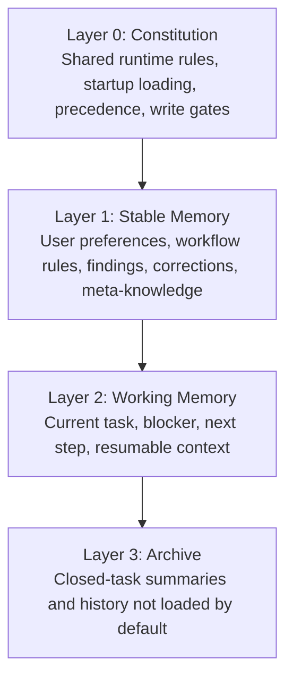
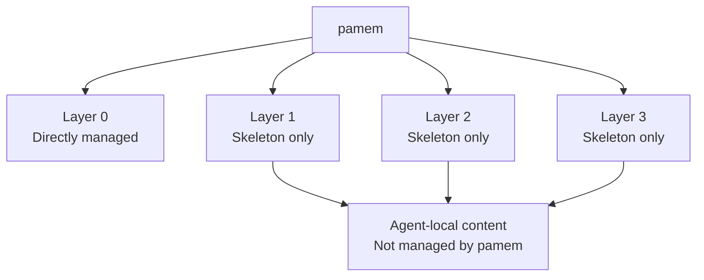

# Design

This document explains the memory model behind `pamem`, what each layer means, and what the plugin is responsible for.

## Memory Model

The model has 4 layers.



### Layer 0: Constitution

This is the memory operating model.

It defines:

- what files exist
- what gets loaded on startup
- how rules conflict and which ones win
- what can enter durable memory
- what must stay out of long-term memory

Layer 0 is not a fact store. It is the governance layer.

### Layer 1: Stable Memory

This is durable memory that should survive across tasks.

Examples:

- `notes/user-preferences.md`
- `notes/agent-workflow.md`
- `notes/experience.md`
- `notes/projects/*`

### Layer 2: Working Memory

This is the active task layer.

Examples:

- `notes/current-task.md`

It should stay short and recovery-oriented.

### Layer 3: Archive

This is history that should be preserved without polluting startup context.

Examples:

- `notes/work-log.md`

It stores summaries, not transcripts.

## What Pamem Manages

`pamem` does not own all 4 layers equally.



### Directly Managed By Pamem

`pamem` directly manages Layer 0 by shipping:

- `memory-rule`
- `sync-request`
- Claude hooks
- Codex bootstrap scripts
- default memory skeleton and startup behavior

### Created But Not Owned By Pamem

`pamem` creates the base structure for Layers 1-3:

- `MEMORY.md`
- `notes/user-preferences.md`
- `notes/agent-workflow.md`
- `notes/experience.md`
- `notes/current-task.md`
- `notes/work-log.md`

But it does not decide the actual contents of those files for a specific agent.

## Design Philosophy

### Stable Governance, Portable Private Data

The runtime should be shared. The memory content should be portable, private, and owned by the user or workspace.

`pamem` should not treat memory as an invisible per-runtime cache. If Claude, Codex, Hermes, or another runtime all participate in the same long-running work, they need a common memory authority rather than separate divergent local memories.

The intended split is:

```text
pamem repository
  runtime, hooks, skills, templates, governance

pamem memory store
  private user/workspace memory content
  project recovery notes
  agent operating experience
  preferences and corrections
  archive summaries
```

The memory store may be a local directory, private Git repository, encrypted synced folder, or another private backend. The important property is that it is explicitly configured and can be shared across runtimes when the user wants consistent memory.

This keeps `pamem` from mixing three different concerns:

- runtime distribution
- private memory content
- sync execution

### Thin Index, Not Transcript

`MEMORY.md` should remain a startup-safe index, not become a running notebook or log.

### Explicit Promotion

Only durable rules, preferences, corrections, reusable findings, and meta-knowledge should move into stable memory.

### Startup-Safe By Default

A new or resumed session should recover the right structure without manual repair.

### Portable By Default

Runtime state should avoid machine-specific leakage wherever possible.

Portable does not mean public. Most memory content is private by default.

### Runtime Over Content

The plugin manages the memory system, not the agent's actual memories.

### Meta-Knowledge Over Knowledge

Agent memory is the schema layer, not the wiki. Its growth direction is not "knowing more facts" but "judging more accurately and retrieving more efficiently". Domain knowledge belongs in external wikis; memory stores the meta-knowledge of how to find and apply that knowledge. The memory system should compound over time: each interaction can yield methodological experience (tool tips, corrected assumptions, workflow improvements) that makes future interactions more effective.

## Cross-Runtime Consistency

`pamem` should support the case where a user switches between Claude, Codex, Hermes, or another agent runtime and expects project memory to remain coherent.

The consistency model is explicit:

```text
same memory store -> shared memory continuity
different memory stores -> divergent memory until synced or reconciled
```

This is different from systems that achieve continuity by routing every device through one long-running agent profile. `pamem` should work even when the runtime changes, as long as each runtime reads and writes the same configured memory store.

### What Belongs In The Memory Store

The memory store should contain memory needed to recover and improve agent behavior:

- user preferences
- project working context
- repo-specific operating notes
- reusable corrections
- tool and environment experience
- "read these files first" recovery pointers
- closed-task summaries worth retaining

It should not become a professional knowledge base.

Domain knowledge belongs in external systems such as LoreForge or another wiki:

| Content | Destination |
|---|---|
| User communication preference | `pamem` memory store |
| Runtime-specific tool experience | `pamem` memory store |
| Current project recovery context | `pamem` memory store |
| Professional concept or source summary | external wiki, not `pamem` |
| Shared research knowledge | external wiki, not `pamem` |
| Source notes and curated indexes | external wiki, not `pamem` |

### Suggested Store Shape

The exact backend is external to the runtime, but a file-backed store should be able to express:

```text
pamem-store/
  MEMORY.md
  notes/
    user-preferences.md
    agent-workflow.md
    experience.md
    current-task.md
    work-log.md
    projects/
      <project-key>.md
    agents/
      claude.md
      codex.md
      hermes.md
  archive/
```

The store can live in a private Git repository or any other private sync backend. If Git is used, it should normally be private and may need encryption or redaction policy before syncing across machines.

### Recovery Contract

For a project that may be resumed by another runtime, `pamem` should preserve enough context to answer:

- which repository or workspace is active
- what the current focus is
- which durable design files should be read first
- which decisions are settled
- which questions remain open
- which external knowledge store should be used

This lets a fresh runtime recover without replaying a full transcript.

## Roadmap

### Phase 1: Store Boundary

- document the runtime/content split clearly
- define the configured memory store path
- describe how a workspace selects a memory store
- keep generated memory content out of the plugin repository

### Phase 2: Cross-Runtime Store Support

- support a shared memory store for Claude, Codex, Hermes, and other runtimes
- distinguish global, project, and agent/runtime-specific memory
- define precedence when runtime-specific notes conflict with common notes
- make startup bootstrap report which memory store was loaded

### Phase 3: Sync Contract

- keep `sync-request` as the standard way to request retention or propagation
- define request examples for private Git-backed memory stores
- document conflict and duplicate handling
- avoid embedding sync executor logic in the plugin runtime

### Phase 4: Privacy And Safety

- document private-by-default expectations
- add redaction guidance for memory entries
- define what must never be written to shared memory
- consider encryption or private-repo recommendations for synced stores

### Phase 5: Recovery Quality

- add project recovery templates
- lint for oversized or stale startup memory
- detect missing project recovery pointers
- improve archive summaries so old sessions remain useful without polluting startup context

### Phase 6: External Knowledge Boundary

- document how `pamem` should point to external knowledge systems such as LoreForge
- keep professional knowledge out of agent memory
- use memory for retrieval strategy, not for storing the retrieved knowledge itself
