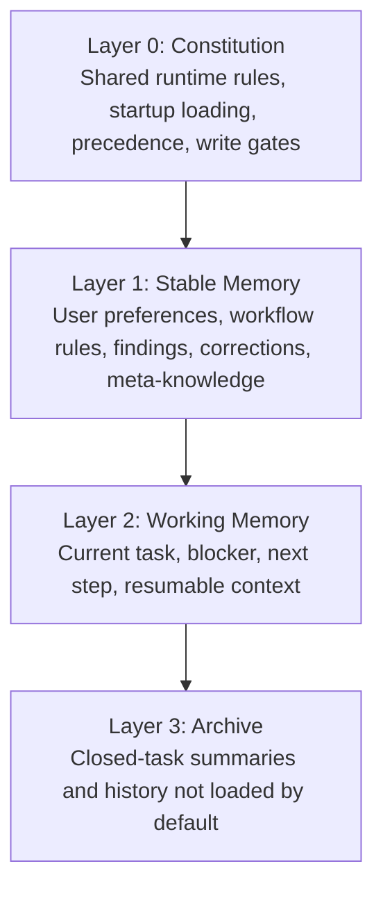
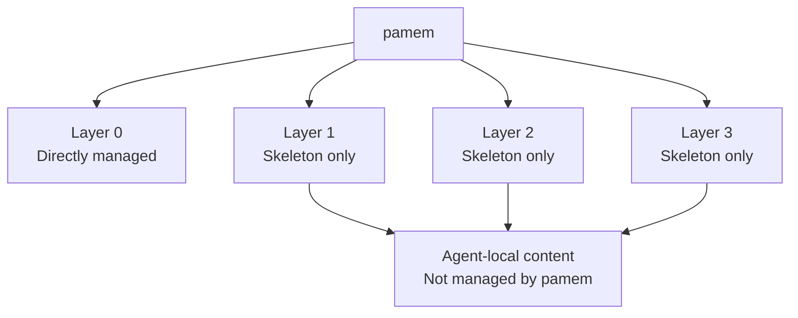

# Design

This document explains the memory model behind `pamem`, what each layer means, and what the plugin is responsible for.

## Memory Model

The model has 4 layers.

### Layer 0: Constitution

This is the memory operating model.

It defines:

- what files exist
- what gets loaded on startup
- how rules conflict and which ones win
- what can enter durable memory
- what must stay out of long-term memory

Layer 0 is not a fact store. It is the governance layer.

### Layer 1: Stable Memory

This is durable memory that should survive across tasks.

Examples:

- `notes/user-preferences.md`
- `notes/agent-workflow.md`
- `notes/findings.md`
- `notes/projects/*`

### Layer 2: Working Memory

This is the active task layer.

Examples:

- `notes/current-task.md`

It should stay short and recovery-oriented.

### Layer 3: Archive

This is history that should be preserved without polluting startup context.

Examples:

- `notes/work-log.md`

It stores summaries, not transcripts.

## What Pamem Manages

`pamem` does not own all 4 layers equally.

### Directly Managed By Pamem

`pamem` directly manages Layer 0 by shipping:

- `memory-rule`
- `sync-request`
- Claude hooks
- Codex bootstrap scripts
- default memory skeleton and startup behavior

### Created But Not Owned By Pamem

`pamem` creates the base structure for Layers 1-3:

- `MEMORY.md`
- `notes/user-preferences.md`
- `notes/agent-workflow.md`
- `notes/findings.md`
- `notes/current-task.md`
- `notes/work-log.md`

But it does not decide the actual contents of those files for a specific agent.

## Design Philosophy

### Stable Governance, Local Data

The runtime should be shared. The memory content should remain local to each agent.

### Thin Index, Not Transcript

`MEMORY.md` should remain a startup-safe index, not become a running notebook or log.

### Explicit Promotion

Only durable rules, preferences, corrections, reusable findings, and meta-knowledge should move into stable memory.

### Startup-Safe By Default

A new or resumed session should recover the right structure without manual repair.

### Portable By Default

Runtime state should avoid machine-specific leakage wherever possible.

### Runtime Over Content

The plugin manages the memory system, not the agent's actual memories.

### Meta-Knowledge Over Knowledge

Agent memory is the schema layer, not the wiki. Its growth direction is not "knowing more facts" but "judging more accurately and retrieving more efficiently". Domain knowledge belongs in external wikis; memory stores the meta-knowledge of how to find and apply that knowledge. The memory system should compound over time: each interaction can yield methodological experience (tool tips, corrected assumptions, workflow improvements) that makes future interactions more effective.
