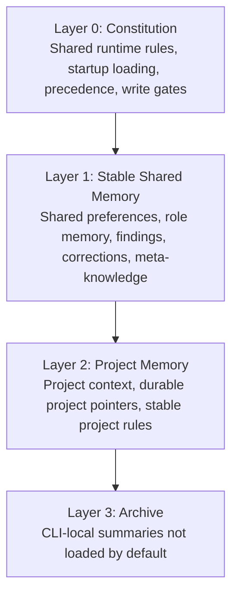
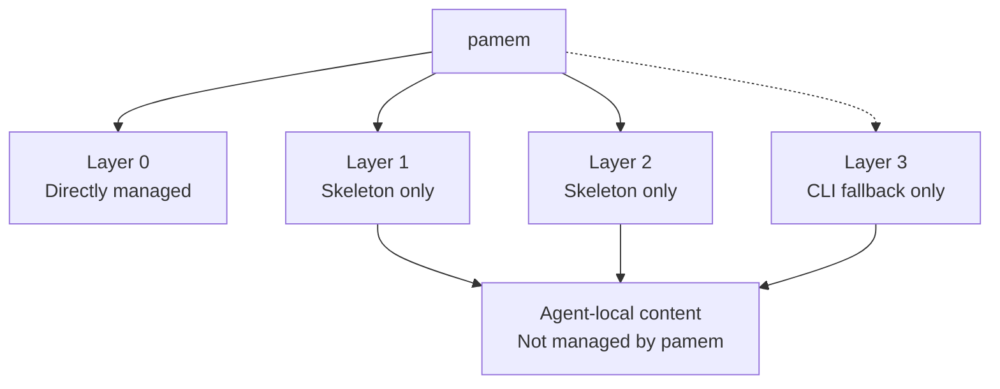

# Design

This document explains the memory model behind `pamem`, what each layer means, and what the plugin is responsible for.

## Memory Model

The model has 4 layers.


```mermaid
flowchart TD
    L0["Layer 0: Constitution<br/>Shared runtime rules, startup loading, precedence, write gates"]
    L1["Layer 1: Stable Shared Memory<br/>Shared preferences, role memory, findings, corrections, meta-knowledge"]
    L2["Layer 2: Project Memory<br/>Project context, durable project pointers, stable project rules"]
    L3["Layer 3: Archive<br/>CLI-local summaries not loaded by default"]

    L0 --> L1
    L1 --> L2
    L2 --> L3
```

### Layer 0: Constitution

This is the memory operating model.

It defines:

- what files exist
- what gets loaded on startup
- how rules conflict and which ones win
- what can enter durable memory
- what must stay out of long-term memory

Layer 0 is not a fact store. It is the governance layer.

### Layer 1: Stable Shared Memory

This is durable memory that should survive across tasks and be reusable by multiple sessions or agents.

Examples:

- `notes/user-preferences.md`
- `notes/operating-rules.md`
- `notes/experience.md`
- `L1/shared/*`
- `L1/roles/<role>.md`

Role-specific shared experience belongs in L1, but it is loaded through profile overlays and does not outrank project-specific memory.

### Layer 2: Project Memory

This is durable project context that should be reusable across sessions.

Examples:

- `L2/projects/<project-key>.md`
- `notes/projects/<project-key>.md`

Project-specific memory belongs in L2, not L1. It should be more specific than role memory and should win over role defaults on conflict.

Runtime-local task state is not part of the shared memory repo. CLI mode may
keep local recovery notes such as `notes/current-task.md`; Slock mode uses the
Slock workspace, task board, and threads as the task-state source of truth.

### Layer 3: Archive

This is history that should be preserved without polluting startup context.

Examples:

- `notes/work-log.md`

It stores summaries, not transcripts. It is a CLI-local fallback surface by
default, not a shared memory repo surface. In Slock mode, pamem does not update
a task work log by default; completed task state remains in Slock unless a
durable, reusable finding is promoted to L1 or L2 project memory.

## What Pamem Manages

`pamem` does not own all 4 layers equally.


```mermaid
flowchart TD
    P["pamem"]
    L0["Layer 0<br/>Directly managed"]
    L1["Layer 1<br/>Skeleton only"]
    L2["Layer 2<br/>Skeleton only"]
    L3["Layer 3<br/>CLI fallback only"]
    C["Agent-local content<br/>Not managed by pamem"]

    P --> L0
    P --> L1
    P --> L2
    P -.-> L3
    L1 --> C
    L2 --> C
    L3 --> C
```

### Directly Managed By Pamem

`pamem` directly manages Layer 0 by shipping:

- `memory-rule`
- `sync-request`
- Claude hooks
- Codex bootstrap scripts
- default memory skeleton and startup behavior
- optional profile/load policy through `.pamem/config.toml`
- shared memory repo bootstrap and sync helper entry points

### Created But Not Owned By Pamem

`pamem` creates the base durable memory structure in the shared memory repo and,
for CLI runtime mode, small workspace-local recovery notes:

- `MEMORY.md`
- `L1/shared/*`
- `L1/roles/*`
- `L2/projects/*`
- `notes/user-preferences.md`
- `notes/operating-rules.md`
- `notes/experience.md`
- `notes/projects/*`
- `notes/current-task.md` in CLI runtime mode
- `notes/work-log.md` in CLI runtime mode

But it does not decide the actual contents of those files for a specific agent.

## Design Philosophy

### Stable Governance, Shared Runtime

The runtime should be shared. The memory content may live in a shared repo or a workspace fallback, but the repo location, sharing mode, and sync policy are configuration, not hardcoded behavior.

### Local Convenience, Shared Infrastructure

CLI-native memory is a convenience feature for one tool, one machine, or one session flow.
`pamem` is the shared infrastructure around that feature: it standardizes durable memory
layers, profile selection, write gates, promotion, and sync boundaries so Claude, Codex,
and Slock can share the same governed memory without turning runtime-local task state into
shared history.

### Thin Index, Not Transcript

`MEMORY.md` should remain a startup-safe index, not become a running notebook or log.

### Explicit Promotion

Only durable rules, preferences, corrections, reusable findings, and meta-knowledge should move into stable memory.

Project-specific context should remain in L2 unless it becomes a reusable cross-project rule or role finding.

### Profile Overlays

Profiles choose which role memory and project memory to load. The profile itself does not create precedence. The default memory precedence is:

```text
L0 constitution > L1 shared > L2 project > L1 role > CLI-local recovery > L3 archive
```

This keeps role memory useful as shared experience while allowing project-specific constraints to win.
Runtime task state is an execution hint. It must not redefine durable project,
role, shared, or constitution memory.

In practice, a workspace should activate one `default_profile` at a time. The
templates in `assets/config-profiles/` are standalone starters for alternate
defaults, not simultaneous runtime roles.

Profile selection belongs to onboarding. `onboard-pamem.sh` writes the selected
`.pamem/config.toml` before runtime hooks start reading it; startup and compact
hooks must treat the selected profile as read-only policy.

### Config Ownership

When a workspace uses `.pamem/config.toml`, that file is the workspace-local source of truth for profiles, memory repo location, sharing mode, load targets, write targets, and sync policy. It belongs to the agent workspace or machine-local bootstrap area, not inside the shared memory repo itself. Onboarding can seed it from `assets/config.toml.template`, but ordinary task agents should treat it as read-only and route changes through the config owner or onboarding review.

### Memory Lint

`memory-lint` is an explicit, report-only check. It reads the workspace-local `.pamem/config.toml`, resolves the configured memory repo, and reports issues such as missing profile load targets, broken `MEMORY.md` pointers, invalid runtime mode, oversized entry files, or an accidental `.pamem/config.toml` committed inside the memory repo.

It must not run automatically from startup or compact hooks, and it must not repair, promote, sync, or rewrite memory files.

### Instance Isolation

Multiple agent instances may share the same memory repo, but they must not share
mutable task state through that repo. The shared repo is for durable L0/L1/L2
project memory and promotion requests. Runtime state is owned by the runtime:
CLI mode keeps local recovery notes, while Slock mode uses Slock task state,
workspace files, and task threads.

When many instances are active, the shared repo `MEMORY.md` should stay a thin
index to durable memory. It may point to project notes, but it should not try to
list every active task. Any CLI current-task summary is workspace-local; Slock
task state remains in Slock.

### Startup-Safe By Default

A new or resumed session should recover the right structure without manual repair.

### Portable By Default

Runtime state should avoid machine-specific leakage wherever possible.

### Runtime Over Content

The plugin manages the memory system, not the agent's actual memories.

### Meta-Knowledge Over Knowledge

Agent memory is the schema layer, not the wiki. Its growth direction is not "knowing more facts" but "judging more accurately and retrieving more efficiently". Domain knowledge belongs in external wikis; memory stores the meta-knowledge of how to find and apply that knowledge. The memory system should compound over time: each interaction can yield methodological experience (tool tips, corrected assumptions, workflow improvements) that makes future interactions more effective.

### Sync Request Separation

`sync-request` remains a separate skill. `memory-rule` decides whether a memory or managed-config change is durable and eligible for retention; `sync-request` only creates a structured request when explicitly asked or when workspace policy requires one. It is not a mechanism for project work, branches, PRs, or source-code delivery.
