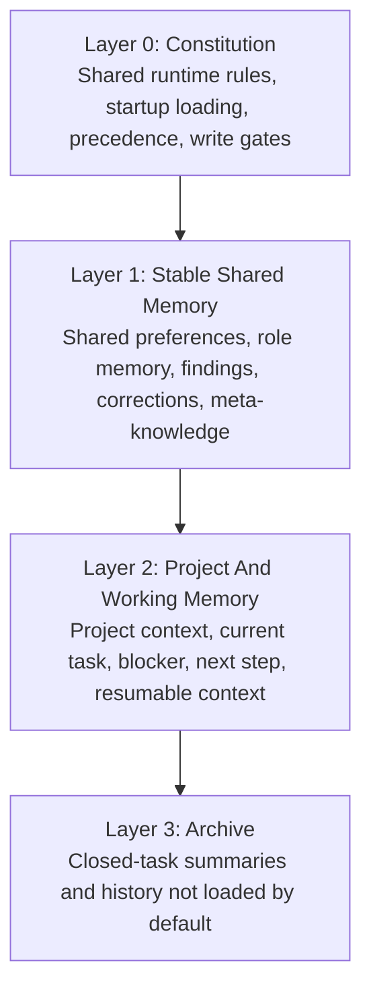
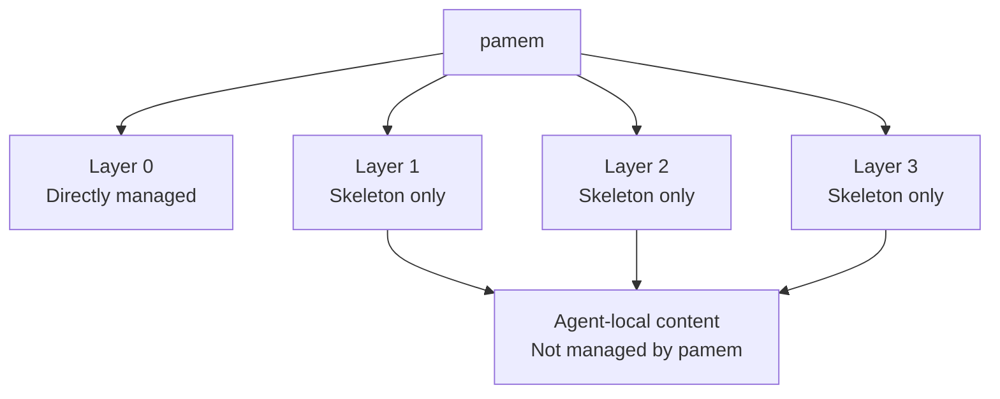

# Design

This document explains the memory model behind `pamem`, what each layer means, and what the plugin is responsible for.

## Memory Model

The model has 4 layers.


```mermaid
flowchart TD
    L0["Layer 0: Constitution<br/>Shared runtime rules, startup loading, precedence, write gates"]
    L1["Layer 1: Stable Shared Memory<br/>Shared preferences, role memory, findings, corrections, meta-knowledge"]
    L2["Layer 2: Project And Working Memory<br/>Project context, current task, blocker, next step, resumable context"]
    L3["Layer 3: Archive<br/>Closed-task summaries and history not loaded by default"]

    L0 --> L1
    L1 --> L2
    L2 --> L3
```

### Layer 0: Constitution

This is the memory operating model.

It defines:

- what files exist
- what gets loaded on startup
- how rules conflict and which ones win
- what can enter durable memory
- what must stay out of long-term memory

Layer 0 is not a fact store. It is the governance layer.

### Layer 1: Stable Shared Memory

This is durable memory that should survive across tasks and be reusable by multiple sessions or agents.

Examples:

- `notes/user-preferences.md`
- `notes/agent-workflow.md`
- `notes/experience.md`
- `L1/shared/*`
- `L1/roles/<role>.md`

Role-specific shared experience belongs in L1, but it is loaded through profile overlays and does not outrank project-specific memory.

### Layer 2: Project And Working Memory

This is the project and active task layer.

Examples:

- `L2/projects/<project-key>.md`
- `L2/active/<task-id>.md`
- `notes/projects/<project-key>.md`
- `notes/current-task.md`

Project-specific memory belongs in L2, not L1. It should be more specific than role memory and should win over role defaults on conflict. Active task memory should stay short and recovery-oriented.

### Layer 3: Archive

This is history that should be preserved without polluting startup context.

Examples:

- `notes/work-log.md`

It stores summaries, not transcripts.

## What Pamem Manages

`pamem` does not own all 4 layers equally.


```mermaid
flowchart TD
    P["pamem"]
    L0["Layer 0<br/>Directly managed"]
    L1["Layer 1<br/>Skeleton only"]
    L2["Layer 2<br/>Skeleton only"]
    L3["Layer 3<br/>Skeleton only"]
    C["Agent-local content<br/>Not managed by pamem"]

    P --> L0
    P --> L1
    P --> L2
    P --> L3
    L1 --> C
    L2 --> C
    L3 --> C
```

### Directly Managed By Pamem

`pamem` directly manages Layer 0 by shipping:

- `memory-rule`
- `sync-request`
- Claude hooks
- Codex bootstrap scripts
- default memory skeleton and startup behavior
- optional profile/load policy through `.pamem/config.toml` when a shared memory repo provides one

### Created But Not Owned By Pamem

`pamem` creates the base structure for Layers 1-3:

- `MEMORY.md`
- `notes/user-preferences.md`
- `notes/agent-workflow.md`
- `notes/experience.md`
- `notes/projects/*`
- `notes/current-task.md`
- `notes/work-log.md`

But it does not decide the actual contents of those files for a specific agent.

## Design Philosophy

### Stable Governance, Local Data

The runtime should be shared. The memory content should remain local to each agent.

### Thin Index, Not Transcript

`MEMORY.md` should remain a startup-safe index, not become a running notebook or log.

### Explicit Promotion

Only durable rules, preferences, corrections, reusable findings, and meta-knowledge should move into stable memory.

Project-specific context should remain in L2 unless it becomes a reusable cross-project rule or role finding.

### Profile Overlays

Profiles choose which role memory and project/task memory to load. The profile itself does not create precedence. The default memory precedence is:

```text
L0 constitution > L1 shared > L2 project > L1 role > L2 task > L3 archive
```

This keeps role memory useful as shared experience while allowing project-specific constraints to win.

### Config Ownership

When a workspace uses `.pamem/config.toml`, that file is the source of truth for profiles, load targets, write targets, and sync policy. Onboarding can seed it from `assets/config.toml.template`, but ordinary task agents should treat it as read-only and route changes through the config owner or onboarding review.

### Instance Isolation

Multiple agent instances may share the same `MEMORY.md` index, but they must not share mutable active state. Instance-specific state lives in per-task active files or worktree-local planning files; the index stays pointer-only, and shared L0/L1 memory remains read-only during ordinary execution.

When many instances are active, `MEMORY.md` should summarize the lead blocker, primary workstream, and a pointer to the full active roster. The complete instance list belongs in `notes/current-task.md` or per-task L2 files, not in the startup index.

### Startup-Safe By Default

A new or resumed session should recover the right structure without manual repair.

### Portable By Default

Runtime state should avoid machine-specific leakage wherever possible.

### Runtime Over Content

The plugin manages the memory system, not the agent's actual memories.

### Meta-Knowledge Over Knowledge

Agent memory is the schema layer, not the wiki. Its growth direction is not "knowing more facts" but "judging more accurately and retrieving more efficiently". Domain knowledge belongs in external wikis; memory stores the meta-knowledge of how to find and apply that knowledge. The memory system should compound over time: each interaction can yield methodological experience (tool tips, corrected assumptions, workflow improvements) that makes future interactions more effective.

### Sync Request Separation

`sync-request` remains a separate skill. `memory-rule` decides whether a memory or managed-config change is durable and eligible for retention; `sync-request` only creates a structured request when explicitly asked or when workspace policy requires one. It is not a mechanism for project work, branches, PRs, or source-code delivery.
