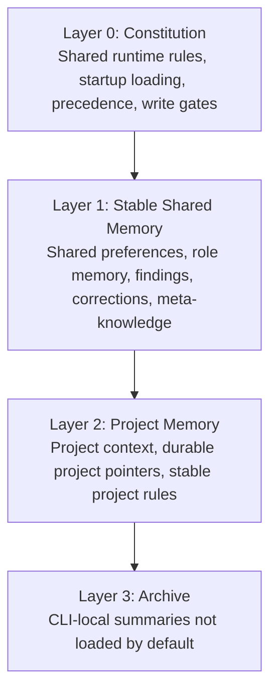
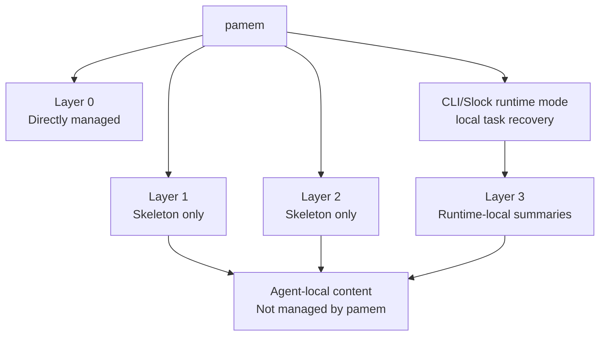

# Design

This document explains the memory model behind `pamem`, what each layer means, and what the plugin is responsible for.

## Memory Model

The model has 4 layers.

The layer names are logical contracts, not a requirement that every runtime or
every storage backend must mirror the same folder names. The current shared-repo
layout uses directories like `L0/`, `L1/`, and `L2/` because they are easy to
bootstrap and lint, but the meaning comes from the layer contract, not the
path shape.


```mermaid
flowchart TD
    L0["Layer 0: Constitution<br/>Shared runtime rules, startup loading, precedence, write gates"]
    L1["Layer 1: Stable Shared Memory<br/>Shared preferences, role memory, findings, corrections, meta-knowledge"]
    L2["Layer 2: Project Memory<br/>Project context, durable project pointers, stable project rules"]
    L3["Layer 3: Archive<br/>CLI-local summaries not loaded by default"]

    L0 --> L1
    L1 --> L2
    L2 --> L3
```

### Layer 0: Constitution

This is the memory operating model.

It defines:

- what files exist
- what gets loaded on startup
- how rules conflict and which ones win
- what can enter durable memory
- what must stay out of long-term memory

Layer 0 is not a fact store. It is the governance layer.

### Layer 1: Stable Shared Memory

This is durable memory that should survive across tasks and be reusable by multiple sessions or agents.

Examples:

- `notes/user-preferences.md`
- `notes/operating-rules.md`
- `notes/experience.md`
- `L1/shared/*`
- `L1/roles/<role>/experience.md`

Role-specific experience belongs in `L1/roles/<role>/experience.md`, with `notes/experience.md` as the compatibility surface. `notes/projects/<project-key>.md` is the compatibility surface for `L2/projects/<project-key>.md`. These are loaded through profile overlays and do not outrank project-specific memory.

### Layer 2: Project Memory

This is durable project context that should be reusable across sessions.

Examples:

- `L2/projects/<project-key>.md`
- `notes/projects/<project-key>.md`

Project-specific memory belongs in L2, not L1. It should be more specific than role memory and should win over role defaults on conflict.

`projects/` is a namespace inside L2, not another layer.

Runtime-local task state is not part of the shared memory repo. CLI mode keeps
local recovery notes in the XDG data agent home or compatibility files such as
`notes/current-task.md`; Slock mode keeps `notes/current-task.md` and
`notes/work-log.md` in the Slock workspace while the task board and threads
remain the execution record.

### Layer 3: Archive

This is history that should be preserved without polluting startup context.

Examples:

- `notes/work-log.md`

It stores summaries, not transcripts. It is runtime-local, not a shared memory
repo surface. In CLI mode it lives in the agent home or compatibility workspace
notes; in Slock mode it lives in the Slock workspace. Durable, reusable findings
should be promoted to L1 or L2 project memory instead of being left only in a
work log.

## What Pamem Manages

`pamem` does not own all 4 layers equally.


```mermaid
flowchart TD
    P["pamem"]
    L0["Layer 0<br/>Directly managed"]
    L1["Layer 1<br/>Skeleton only"]
    L2["Layer 2<br/>Skeleton only"]
    L3["Layer 3<br/>Runtime-local summaries"]
    CLI["CLI/Slock runtime mode<br/>local task recovery"]
    C["Agent-local content<br/>Not managed by pamem"]

    P --> L0
    P --> L1
    P --> L2
    P --> CLI
    CLI --> L3
    L1 --> C
    L2 --> C
    L3 --> C
```

### Directly Managed By Pamem

`pamem` directly manages Layer 0 by shipping:

- `memory-rule`, `sync-request`, and `memory-lint` plugin skills
- bootstrap/repair behavior that exposes those skills to supported runtimes
- Claude `SessionStart` hook
- Codex bootstrap scripts
- default memory skeleton and read-only startup behavior
- optional profile/load policy through `config.toml` or `.pamem/config.toml`
- shared memory repo bootstrap and sync helper entry points

If `memory-rule` or `sync-request` is missing during a runtime session, treat
that as an incomplete pamem plugin/bootstrap installation. Until onboarding or a
human repairs it, agents may read injected startup context but must not change
shared memory, local memory config, sync policy, or run repo sync.

### Created But Not Owned By Pamem

`pamem` creates the base durable memory structure in the shared memory repo and
small runtime-local recovery notes:

- `MEMORY.md`
- `L1/shared/*`
- `L1/roles/<role>/experience.md`
- `L2/projects/*`
- `notes/user-preferences.md` as a local compatibility copy in CLI mode or a symlink to `L1/shared/preferences.md` in Slock mode
- `notes/operating-rules.md` as a local compatibility copy in CLI mode or a symlink to `L1/shared/operating-rules.md` in Slock mode
- `notes/experience.md` as a local compatibility copy in CLI mode or a symlink to `L1/roles/<role>/experience.md` in Slock mode
- `notes/projects/*` as a local compatibility copy in CLI mode or a symlink to `L2/projects/` in Slock mode
- `notes/current-task.md` in CLI and Slock runtime modes
- `notes/work-log.md` in CLI and Slock runtime modes
- `${XDG_DATA_HOME:-$HOME/.local/share}/pamem/agents/<agent-id>/config.toml` for default CLI agent-home config
- `${XDG_DATA_HOME:-$HOME/.local/share}/pamem/agents/<agent-id>/current-task.md` when `pamem start` or `resume` is used
- `${XDG_DATA_HOME:-$HOME/.local/share}/pamem/agents/<agent-id>/work-log.md` when `pamem start` or `resume` is used

But it does not decide the actual contents of those files for a specific agent.

## Design Philosophy

### Stable Governance, Shared Runtime

The runtime should default to shared durable memory. A local CLI agent home is
the runtime/config anchor; the default memory repo is machine-level shared state
at `${XDG_DATA_HOME:-$HOME/.local/share}/pamem/memory`. The repo location,
sharing mode, and sync policy remain configurable for teams that need a separate
repo or remote backend. Legacy or Slock workspaces may still use
`.pamem/config.toml`.

In Slock runtime mode, the Slock-generated agent workspace is the config, hook,
and task-recovery anchor, not the memory repo. Its `.pamem/config.toml` should
normally point to the same machine-level shared memory repo so multiple Slock
and CLI agents can reuse durable memory while Slock continues to own task state.
Workspace L1 note files are symlinks into the shared memory repo and should be
treated as governed shared memory, not independent local files.

### Local Convenience, Shared Infrastructure

CLI-native memory is a convenience feature for one tool, one machine, or one session flow.
`pamem` is the shared infrastructure around that feature: it standardizes durable memory
layers, profile selection, write gates, promotion, and sync boundaries so Claude, Codex,
and Slock can share the same governed memory without turning runtime-local task state into
shared history.

Direct CLI sessions may start from different shell directories. `pamem`
provides the stable runtime anchor: with `--agent-id`, it resolves the agent
home at `${XDG_DATA_HOME:-$HOME/.local/share}/pamem/agents/<agent-id>/`, reads
that home’s `config.toml`, and keeps CLI task recovery there rather than inside
the shared memory repo. The runtime source can be a plugin, source checkout, or
future standalone install; the agent home does not copy scripts or assets.
`start -- <launcher>` records the launcher command in the local agent home so
`resume` can reuse it. Runtime-native resume can be expressed with
`[runtime.resume].command`; if neither exists, `resume` fails rather than
silently starting a new session.
Runtimes that cannot load pamem as a plugin or hook can still use
`pamem context --agent-id <agent-id>` as a source-agnostic adapter and inject the
printed startup context through their own prompt/context mechanism.

### Thin Index, Not Transcript

`MEMORY.md` should remain a startup-safe index, not become a running notebook or log.

### Explicit Promotion

Only durable rules, preferences, corrections, reusable findings, and meta-knowledge should move into stable memory.

Project-specific context should remain in L2 unless it becomes a reusable cross-project rule or role finding.

### Profile Overlays

Profiles choose which role memory and project memory to load. The profile itself does not create precedence. The default memory precedence is:

```text
L0 constitution > L1 shared > L2 project > L1 role > CLI-local recovery > L3 archive
```

This keeps role memory useful as shared experience while allowing project-specific constraints to win.
Runtime task state is an execution hint. It must not redefine durable project,
role, shared, or constitution memory.

In practice, an agent home or workspace should activate one `default_profile` at
a time. The templates in `assets/config-profiles/` are standalone starters for
alternate defaults, not simultaneous runtime roles.

Profile selection belongs to onboarding. `pamem init` writes the selected
`config.toml` before runtime hooks start reading it; startup hooks must treat the
selected profile as read-only policy. Explicit workspace onboarding still writes
`.pamem/config.toml` for compatibility.

### Config Ownership

When an agent home uses `config.toml`, or a workspace uses `.pamem/config.toml`,
that file is the local source of truth for profiles, memory repo location,
sharing mode, load targets, write targets, and sync policy. It belongs to the
agent home or workspace, not inside the shared memory repo itself. Onboarding can
seed it from `assets/config.toml.template`, but ordinary task agents should
treat it as read-only and route changes through the config owner or onboarding
review.

### Memory Lint

`memory-lint` is an explicit, report-only check. It reads agent-local
`config.toml` or workspace-local `.pamem/config.toml`, resolves the configured
memory repo, and reports issues such as missing profile load targets, broken
`MEMORY.md` pointers, invalid runtime mode, oversized entry files, or an
accidental `.pamem/config.toml` committed inside the memory repo.

It must not run automatically from startup or compact hooks, and it must not repair, promote, sync, or rewrite memory files.

### Hook Boundaries

`SessionStart` is retained because it is the runtime's read-only memory loader.
It may report a missing or oversized memory entry file, but it must not create,
repair, rewrite, promote, or sync shared memory.

An automatic `PreCompact` hook is not part of the runtime contract. Compact-time
automatic writes are too easy to confuse with durable memory promotion. The
`memory-pre-compact.sh` script remains only as an explicit runtime-local helper
for current-task state; it must not write the shared memory repo.

### Instance Isolation

Multiple agent instances may share the same memory repo, but they must not share
mutable task state through that repo. The shared repo is for durable L0/L1/L2
project memory and promotion requests. Runtime state is owned by the runtime:
CLI mode keeps local recovery notes in the XDG data agent home or compatibility
workspace notes, while Slock mode uses workspace `notes/current-task.md`,
workspace `notes/work-log.md`, the Slock task board, and task threads.

When many instances are active, the shared repo `MEMORY.md` should stay a thin
index to durable memory. It may point to project notes, but it should not try to
list every active task. CLI current-task summaries are local to the agent home
or compatibility workspace; Slock current-task summaries are local to the Slock
workspace.

### Startup-Safe By Default

A new or resumed session should load the configured memory structure when it is
present and surface clear repair instructions when it is missing. Bootstrap and
repair scripts create structure; startup hooks only read it.

### Portable By Default

Runtime state should avoid machine-specific leakage wherever possible.

### Runtime Over Content

The plugin manages the memory system, not the agent's actual memories.

### Meta-Knowledge Over Knowledge

Agent memory is the schema layer, not the wiki. Its growth direction is not "knowing more facts" but "judging more accurately and retrieving more efficiently". Domain knowledge belongs in external wikis; memory stores the meta-knowledge of how to find and apply that knowledge. The memory system should compound over time: each interaction can yield methodological experience (tool tips, corrected assumptions, workflow improvements) that makes future interactions more effective.

### Plugin Capability Boundary

`memory-rule` and `sync-request` are pamem runtime capabilities, not optional
advice. Supported bootstrap paths should expose them to the agent runtime. A
missing capability is a setup or runtime exposure problem to repair, not
permission for ordinary task agents to bypass governance by editing memory,
config, sync queues, or repo sync behavior directly.

### Sync Request Separation

Sync request handoff remains separate from memory governance. Memory governance
decides whether a memory or managed-config change is durable and eligible for
retention; a sync request only records the intent when explicitly asked or when
workspace policy requires one. Use the `sync-request` plugin skill to create the
structured request. If it is unavailable, repair pamem plugin exposure before
creating requests; do not create ad hoc queue files or run sync directly. This
is not a mechanism for project work, branches, PRs, or source-code delivery.

### Sync Risk Surface

The highest-risk operation is actual propagation of the shared memory repo:
`memory-sync.sh` can commit and push for `git`, or run `rclone bisync` for
`webdav`. It is executor-only unless a user explicitly assigns sync-executor
responsibility.

`config.toml` or `.pamem/config.toml` changes are also high risk because they can redirect the
memory repo, backend, remote, profile, write targets, or executor. Treat config
changes as onboarding/config-owner work.

A sync request is lower risk than direct sync because it only writes or hands
off a pending request, but it can trigger an external executor. Use it only when
the user explicitly asks or workspace policy requires retention.
