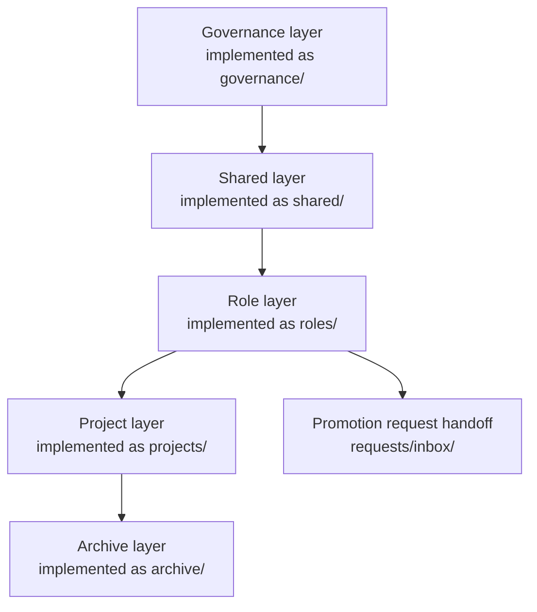
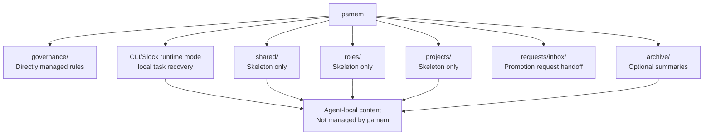

# Design

This document explains the memory model behind `pamem`, what each layer means, and what the plugin is responsible for.

## Memory Model

The design is layered. Each layer has a clear responsibility, and the concrete
shared-memory repo uses self-describing directory names for those layers so a
user can understand the repo shape without reading this design doc first.


```mermaid
flowchart TD
    G["Governance layer<br/>implemented as governance/"]
    S["Shared layer<br/>implemented as shared/"]
    R["Role layer<br/>implemented as roles/"]
    P["Project layer<br/>implemented as projects/"]
    A["Archive layer<br/>implemented as archive/"]
    Q["Promotion request handoff<br/>requests/inbox/"]

    G --> S
    S --> R
    R --> P
    P --> A
    R --> Q
```

| Design layer | Responsibility | Implementation |
|---|---|---|
| Governance | Runtime rules, startup loading, precedence, write gates | `governance/`, plus shipped `memory-rule` |
| Shared | Cross-role preferences, operating rules, reusable experience | `shared/` |
| Role | Concrete role guides and role-specific experience | `roles/<role>/` |
| Project | Durable project context and pointers | `projects/` |
| Archive | Historical summaries not loaded by default | `archive/` |
| Promotion request handoff | Reviewable proposed memory changes, kept separate from loaded memory layers | `requests/inbox/` |

### Governance Layer

This is the memory operating model.

It defines:

- what files exist
- what gets loaded on startup
- how rules conflict and which ones win
- what can enter durable memory
- what must stay out of long-term memory

The main shared file is `governance/constitution.md`. It is not a fact store.

### Shared Layer

This is durable cross-role memory that should survive across tasks and be
reusable by multiple sessions or agents.

Examples:

- `notes/user-preferences.md`
- `notes/operating-rules.md`
- `notes/experience.md`
- `shared/*`
- `shared/experience.md`

Shared preferences live in `shared/preferences.md`, stable operating defaults
live in `shared/operating-rules.md`, and cross-role experience lives in
`shared/experience.md`.

### Role Layer

Role-specific entry points live in `roles/<role>/<role>.md`. Keep
high-frequency role workflow and pointers there. Reusable role experience lives
in `roles/<role>/experience.md`; when that file grows too large, split detailed
topics into smaller role-local files and point to them from the role guide.
`notes/experience.md` remains the CLI compatibility surface for role experience.
Pamem may use a packaged base role template when bootstrapping or promoting new
role guides, but that template is not materialized into the shared memory repo
or loaded at runtime.

### Project Layer

This is durable project context that should be reusable across sessions.

Examples:

- `projects/<project-key>.md`
- `notes/projects/<project-key>.md`

Project-specific memory belongs in `projects/`. It should be more specific
than role memory and should win over role defaults on conflict.

### Archive Layer

`archive/` is for history that should be preserved without polluting startup
context. It stores summaries, not transcripts. It is not loaded by default.

Runtime-local task state is not part of the shared memory repo. CLI mode keeps
local recovery notes in the XDG data agent home or compatibility files such as
`notes/current-task.md`; Slock mode keeps `notes/current-task.md` and
`notes/work-log.md` in the Slock workspace while the task board and threads
remain the execution record.

`current-task.md` and `work-log.md` are deliberately separate. `current-task.md`
is the active recovery pointer: current task, phase, blocker, and next step. It
is especially important in non-Slock runtimes because there may be no task board
or thread history to recover from. `work-log.md` is completed-work history:
short summaries, validation results, and handoff notes.

Both files are scoped to one runtime instance. Multiple role instances may share
the same memory repo and project memory, but each instance needs its own agent
home or Slock workspace so active task state does not collide across roles.

## What Pamem Manages

`pamem` creates the shared repo skeleton and owns the runtime loading contract,
but agents and humans own the contents.


```mermaid
flowchart TD
    P["pamem"]
    G["governance/<br/>Directly managed rules"]
    S["shared/<br/>Skeleton only"]
    R["roles/<br/>Skeleton only"]
    PR["projects/<br/>Skeleton only"]
    A["archive/<br/>Optional summaries"]
    Q["requests/inbox/<br/>Promotion request handoff"]
    CLI["CLI/Slock runtime mode<br/>local task recovery"]
    C["Agent-local content<br/>Not managed by pamem"]

    P --> G
    P --> S
    P --> R
    P --> PR
    P --> A
    P --> Q
    P --> CLI
    CLI --> C
    S --> C
    R --> C
    PR --> C
    A --> C
```

### Directly Managed By Pamem

`pamem` directly manages the runtime contract by shipping:

- `memory-rule`, `sync-request`, and `memory-lint` plugin skills
- bootstrap/repair behavior that exposes those skills to supported runtimes
- Claude `SessionStart` hook
- Codex bootstrap scripts
- default memory skeleton and read-only startup behavior
- optional profile/load policy through `config.toml` or `.pamem/config.toml`
- shared memory repo bootstrap and executor policy entry points
- plugin-side agent definitions such as `agents/sync-executor.md`

If `memory-rule` or `sync-request` is missing during a runtime session, treat
that as an incomplete pamem plugin/bootstrap installation. Until onboarding or a
human repairs it, agents may read injected startup context but must not change
shared memory, local memory config, sync policy, or run repo sync.

### Created But Not Owned By Pamem

`pamem` creates the base durable memory structure in the shared memory repo and
small runtime-local recovery notes:

- `MEMORY.md`
- `shared/*`
- `shared/experience.md`
- `roles/<role>/<role>.md`
- `roles/<role>/experience.md`
- `projects/*`
- `notes/user-preferences.md` as a local compatibility copy in CLI mode
- `notes/operating-rules.md` as a local compatibility copy in CLI mode
- `notes/experience.md` as a local compatibility copy in CLI mode for role experience
- `notes/projects/*` as a local compatibility copy in CLI mode
- `notes/current-task.md` in CLI and Slock runtime modes
- `notes/work-log.md` in CLI and Slock runtime modes
- `${XDG_DATA_HOME:-$HOME/.local/share}/pamem/agents/<agent-id>/config.toml` for default CLI agent-home config
- `${XDG_DATA_HOME:-$HOME/.local/share}/pamem/agents/<agent-id>/current-task.md` when `pamem launch` starts or resumes a CLI session
- `${XDG_DATA_HOME:-$HOME/.local/share}/pamem/agents/<agent-id>/work-log.md` when `pamem launch` starts or resumes a CLI session

But it does not decide the actual contents of those files for a specific agent.
Agents may later add role-local topic files through memory promotion when a
role experience topic becomes too detailed for the startup-loaded guide or the
default `experience.md`.

Packaged agents live in the plugin repo, not in the shared memory repo. The
sync executor definition is shipped as `agents/sync-executor.md`; it is not a
profile and must not be seeded into `roles/`.

## Design Philosophy

### Stable Governance, Shared Runtime

The runtime should default to shared durable memory. A local CLI agent home is
the runtime/config anchor; the default memory repo is machine-level shared state
at `${XDG_DATA_HOME:-$HOME/.local/share}/pamem/memory`. The repo location,
sharing mode, and sync policy remain configurable for teams that need a separate
repo or git remote. Legacy or Slock workspaces may still use
`.pamem/config.toml`.

In Slock runtime mode, the Slock-generated agent workspace is the config, hook,
and task-recovery anchor, not the memory repo. Its `.pamem/config.toml` should
normally point to the same machine-level shared memory repo so multiple Slock
and CLI agents can reuse durable memory while Slock continues to own task state.
The workspace `MEMORY.md` stays a thin router/intro only; Memory Governance and
sync trigger instructions live in the shared repo's top-level `MEMORY.md`.
Slock workspaces keep `notes/current-task.md` and `notes/work-log.md` for
runtime-local state, and profile loading reads shared/role memory directly from
the configured memory repo rather than mirroring shared or role files into the workspace.
The Slock task board and threads remain primary; `current-task.md` is a thin
cache for the active pointer, and `work-log.md` is local completed-work history.
Multiple Slock agents naturally get separate copies under
the Slock-managed agent workspace. Slock runtime must not add CLI session-id
records to these files; task, thread, and message ids already provide
provenance.

### Local Convenience, Shared Infrastructure

CLI-native memory is a convenience feature for one tool, one machine, or one session flow.
`pamem` is the shared infrastructure around that feature: it standardizes durable memory
layers, profile selection, write gates, promotion, and sync boundaries so Claude, Codex,
and Slock can share the same governed memory without turning runtime-local task state into
shared history.

Direct CLI sessions may start from different shell directories. `pamem`
provides the stable runtime anchor: with `--agent-id`, it resolves the agent
home at `${XDG_DATA_HOME:-$HOME/.local/share}/pamem/agents/<agent-id>/`, reads
that home’s `config.toml`, and keeps CLI task recovery there rather than inside
the shared memory repo. Use a different `--agent-id` for each concurrent role
instance. The runtime source can be a plugin, source checkout, or future
standalone install; the agent home does not copy scripts or assets.
`pamem launch --role <role> -- <launcher>` records the launcher command in the
local agent home so `--resume` can reuse it. Runtime-native resume can be
expressed with `[runtime.resume].command`; if neither exists, `launch --resume`
fails rather than silently starting a new session.
Each launched or resumed CLI process receives a generated session id. Pamem
stores it in `session.json`, exports it as `PAMEM_SESSION_ID`, and records it in
the local `current-task.md` and `work-log.md` so runtime-local notes can be
traced back to the concrete process session that produced them.
This is CLI-only; Slock runtime does not need pamem session ids because Slock
task, thread, and message ids are the traceability surface.
Runtimes that cannot load pamem as a plugin or hook can still use
`pamem context --agent-id <agent-id>` as a source-agnostic adapter and inject the
printed startup context through their own prompt/context mechanism.

### Thin Index, Not Transcript

`MEMORY.md` should remain a startup-safe index, not become a running notebook or log.

### Explicit Promotion

Only durable rules, preferences, corrections, reusable findings, and meta-knowledge should move into stable memory.

Project-specific context should remain in `projects/` unless it becomes a reusable cross-project rule or role finding.

### Profile Overlays

Profiles choose which shared, role, and project memory to load. The profile itself does not create precedence. The default memory precedence is:

```text
governance > shared > projects > roles > CLI-local recovery > archive
```

This keeps shared and role memory useful as experience while allowing project-specific constraints to win.
Runtime task state is an execution hint. It must not redefine durable project,
role, shared, or constitution memory.

In practice, an agent home or workspace should activate one `default_profile` at
a time. The templates in `assets/config-profiles/` are standalone starters for
alternate defaults, not simultaneous runtime roles. Each profile loads shared
experience and the role guide; the role guide leaves deeper role experience or
topic files for on-demand reading.

Role selection belongs to launch and onboarding. `pamem launch` writes the
selected `config.toml` before runtime hooks start reading it; startup hooks must
treat the selected role policy as read-only. Explicit workspace onboarding
still writes `.pamem/config.toml` for compatibility.

Ordinary task profiles are intentionally narrow write surfaces. They load
shared, role, and project memory. Durable shared-memory changes should be
proposed through PRs; if a promotion request is needed by policy, it is a
separate handoff path in `requests/inbox/`, not part of the loaded memory
layers.

### Config Ownership

When an agent home uses `config.toml`, or a workspace uses `.pamem/config.toml`,
that file is the local source of truth for profiles, memory repo location,
sharing mode, load targets, write targets, sync policy, and optional
`[memory_repo.git]` author identity. It belongs to the agent home or workspace,
not inside the shared memory repo itself. Onboarding can seed it from
`assets/config.toml.template`, but ordinary task agents should treat it as
read-only and route changes through the config owner or onboarding review.

When `[memory_repo.git].author_name` and `author_email` are set, pamem applies
them to the configured memory repo's repo-local `git config user.name` and
`user.email` during install, repair, launch, or onboard. The config remains the
source of truth; the git config is execution state that should be repairable.
The author fields must be configured together.
When pamem initializes a new shared memory repo and either the sync remote or
git author is still unset, the CLI prints a reminder to provide the missing
`[memory_repo.sync].remote` and `[memory_repo.git]` values.

### Memory Lint

`memory-lint` is an explicit, report-only check. It reads agent-local
`config.toml` or workspace-local `.pamem/config.toml`, resolves the configured
memory repo, and reports issues such as missing profile load targets, broken
`MEMORY.md` pointers, invalid runtime mode, oversized entry files, or an
accidental `.pamem/config.toml` committed inside the memory repo. If
`[memory_repo.git]` author identity is configured, lint also verifies that the
repo-local git author is applied.

It must not run automatically from startup or compact hooks, and it must not repair, promote, sync, or rewrite memory files.

### Memory PR Check

`pamem pr-check` is the read-only merge gate for memory PR scope. It compares a
base and head ref in the configured memory repo, verifies that changed files are
inside declared `--target` paths, blocks guarded surfaces unless
`--allow-guarded` is explicitly supplied, and runs `memory-lint`.

The check is meant for both humans and the packaged sync executor. It does not
replace human review: it proves changed-file scope and baseline memory health,
while the reviewer still decides whether the memory content is durable and
correct.

### Noesis Memory Proposal Gate

`pamem check <proposal.json>` is a passive read-only owner gate for a Noesis
`memory_proposal`. It only consumes an already-produced proposal, validates
that the artifact targets pamem, remains proposal-only, contains compact
source references, requires owner review, and does not embed transcripts, raw
logs, or private machine-local paths. It does not observe chats, discover
durable events, route signals, draft learning events, create promote requests,
decide promotion targets, write memory files, apply proposals, or sync
repositories. Workspace-local temporary memory and runtime recovery state may
still be handled through explicit runtime paths; they are separate from the
shared-memory promotion flow.

This command is intentionally not an apply path. It reports whether pamem can
accept the proposal for review, then the memory owner still creates or reviews a
pamem-owned memory PR or request. Noesis owns intake, routing, and proposal
review state; pamem owns memory content, lint, scope checks, and sync handoff.

### Hook Boundaries

`SessionStart` is retained because it is the runtime's read-only memory loader.
It may report a missing or oversized memory entry file, but it must not create,
repair, rewrite, promote, or sync shared memory.

An automatic `PreCompact` hook is not part of the runtime contract. Compact-time
automatic writes are too easy to confuse with durable memory promotion. The
`memory-pre-compact.sh` script remains only as an explicit runtime-local helper
for current-task state; it must not write the shared memory repo.

### Instance Isolation

Multiple agent instances may share the same memory repo, but they must not share
mutable task state through that repo. The shared repo is for durable governance,
shared, role, and project memory. Promotion requests stay in the separate
handoff path. Runtime state is owned by the runtime:
CLI mode keeps local recovery notes in the XDG data agent home or compatibility
workspace notes, while Slock mode uses workspace `notes/current-task.md`,
workspace `notes/work-log.md`, the Slock task board, and task threads.

When many instances are active, the shared repo `MEMORY.md` should stay a thin
index to durable memory. It may point to project notes, but it should not try to
list every active task. CLI current-task summaries are local to the agent home
or compatibility workspace; Slock current-task summaries are local to the Slock
workspace.

### Startup-Safe By Default

A new or resumed session should load the configured memory structure when it is
present and surface clear repair instructions when it is missing. Bootstrap and
repair scripts create structure; startup hooks only read it.

### Portable By Default

Runtime state should avoid machine-specific leakage wherever possible.

### Runtime Over Content

The plugin manages the memory system, not the agent's actual memories.

### Meta-Knowledge Over Knowledge

Agent memory is the schema layer, not the wiki. Its growth direction is not "knowing more facts" but "judging more accurately and retrieving more efficiently". Domain knowledge belongs in external wikis; memory stores the meta-knowledge of how to find and apply that knowledge. The memory system should compound over time: each interaction can yield methodological experience (tool tips, corrected assumptions, workflow improvements) that makes future interactions more effective.

### Plugin Capability Boundary

`memory-rule` and `sync-request` are pamem runtime capabilities, not optional
advice. Supported bootstrap paths should expose them to the agent runtime. A
missing capability is a setup or runtime exposure problem to repair, not
permission for ordinary task agents to bypass governance by editing memory,
config, sync queues, or repo sync behavior directly.

### Sync Request Separation

Sync request handoff remains separate from memory governance. Memory governance
decides whether a memory or managed-config change is durable and eligible for
retention; a sync request only records the intent when explicitly asked or when
workspace policy requires one. Use the `sync-request` plugin skill to create the
structured request. If it is unavailable, repair pamem plugin exposure before
creating requests; do not create ad hoc queue files or run sync directly. This
is not a mechanism for project work, branches, PRs, or source-code delivery.

### Sync Risk Surface

The highest-risk operation is actual propagation of the shared memory repo:
git push is executor-only unless a user explicitly assigns sync-executor responsibility.

`config.toml` or `.pamem/config.toml` changes are also high risk because they can redirect the
memory repo, remote, profile, write targets, or executor. Treat config
changes as onboarding/config-owner work.

A sync request is lower risk than direct sync because it only writes or hands
off a pending request, but it can trigger an assigned executor. Use it only when
the user explicitly asks or workspace policy requires retention.
