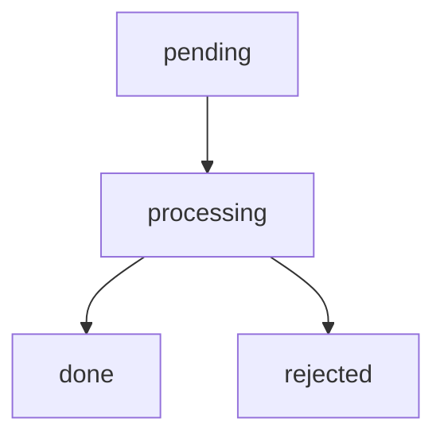

# Sync

This document explains how `pamem` fits with `sync-request`.

It intentionally describes the **protocol and boundaries**, not a concrete sync executor implementation.

## Purpose

`pamem` provides the shared memory runtime for a workspace.

`sync-request` provides the shared way to ask for cross-device retention when durable local memory or managed workspace config changes should be propagated elsewhere.

It is intentionally **not** a channel for project work, source code, branches, or PR workflow.

In short:

- `pamem` manages local memory runtime
- `sync-request` creates structured requests for external sync
- an external executor consumes those requests

## Boundary

`pamem` does **not** ship a sync executor.

It does not include:

- git push logic
- config-repo workflows
- remote copy or delete logic
- note publication logic
- environment-specific sync policy
- source-code delivery
- branch or PR transport
- review-state propagation for project work

That part is intentionally left external.

## Relationship


## When To Use `sync-request`

Create a sync request when local changes are durable enough that they should be retained or propagated beyond the current workspace.

Typical cases:

- `MEMORY.md` changed in a meaningful way
- stable notes changed
- managed workspace config changed
- reusable summaries or findings should be retained across devices

Do not create a request for:

- scratch notes
- raw logs
- transient planning files
- unstable in-progress chatter
- source code or repo history
- feature branches, PRs, or review status
- project work whose main purpose is code delivery rather than memory/config retention

## Queue Model

The queue is:

```text
~/sync-queue/
  pending/
  processing/
  done/
  rejected/
```

`sync-request` only creates or refreshes files in `pending/`.

An external executor is responsible for moving requests through the lifecycle.

## Request Lifecycle



### `pending`

Request exists and has not yet been handled by the executor.

### `processing`

Executor has claimed the request and is currently evaluating or applying it.

### `done`

Executor accepted and completed the sync operation.

### `rejected`

Executor declined the request or could not complete it safely.

## Roles

### Workspace Agent

The workspace agent may:

- decide a durable change is worth syncing
- generate or refresh a request with `sync-request`
- provide the authoritative source paths

The workspace agent must not:

- process the queue
- mutate `processing`, `done`, or `rejected`
- directly execute environment-specific sync logic under the `sync-request` contract

### External Executor

The external executor may:

- read `pending/`
- validate requests
- deduplicate or reject requests
- perform environment-specific sync logic
- move requests to `processing`, `done`, or `rejected`

## How This Maps To Memory Layers

`sync-request` mostly interacts with:

- **Layer 1: Stable Memory**
  - user preferences
  - workflow rules
  - corrections
  - project notes
- **Layer 3: Archive**
  - closed-task summaries when they should be retained externally

It may also be used for managed workspace config changes that support the memory runtime itself.

It should not be used as a substitute for normal Layer 2 working-memory handling.

## Design Principle

The public contract is:

- local runtime is standardized
- sync intent is standardized
- sync execution remains private and replaceable

This keeps `pamem` portable while allowing different users to implement different sync backends.
