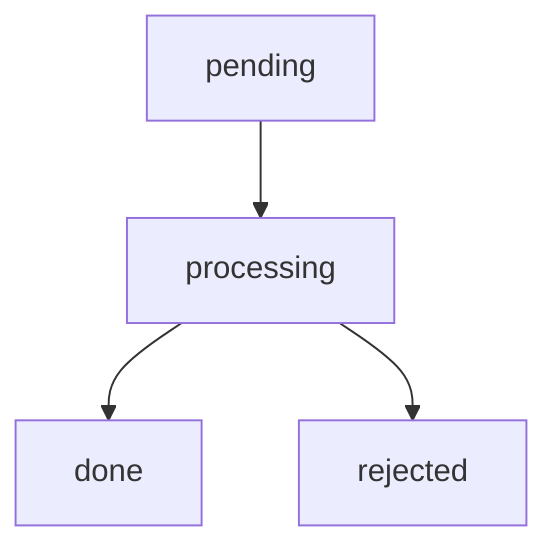

# Sync

This document explains how `pamem` fits with sync request handoff, the packaged
sync executor agent definition, and the standalone memory repo sync helper.

It describes the **protocol and boundaries**. The packaged sync executor is an
agent definition, not an always-running daemon, scheduler, or credential store.

## Purpose

`pamem` provides the shared memory runtime for a workspace.

Sync request handoff provides the shared way to ask for cross-device retention
when durable local memory or managed workspace config changes should be
propagated elsewhere and the user explicitly asks or workspace policy requires
retention. Use the `sync-request` plugin skill to create the structured request.
If `sync-request` is unavailable, pamem plugin/bootstrap exposure is incomplete:
do not create ad hoc queue files, do not run sync directly, and ask onboarding or
the sync executor to repair the runtime capability.

`scripts/memory-sync.sh` is the repo-level sync helper. Installed workspaces call it through `.pamem/scripts/memory-sync.sh`. It knows how to sync the configured memory repo backend (`local`, `git`, or `webdav`) and is meant for the sync executor or a dedicated sync capability, not for ordinary task delivery.

It is intentionally **not** a channel for project work, source code, branches, or PR workflow.

In short:

- `pamem` manages local memory runtime
- sync request handoff creates structured requests for external sync
- the packaged sync executor or another assigned executor consumes those requests
- a sync executor may call `scripts/memory-sync.sh` when it is time to propagate the configured memory repo

## Boundary

`pamem` ships a sync executor agent definition at `agents/sync-executor.md`.
That agent is packaged with the plugin; it is not a memory profile and is not
seeded into the shared memory repo.
Ordinary agents do not start or assign the sync executor during session start; they hand off durable memory/config changes as PRs or promotion requests, and executor-side review decides when sync-executor work is activated.

`pamem` still does not include:

- sync scheduling or queue processing
- backend-selection policy
- credential management
- note publication logic
- environment-specific sync policy
- source-code delivery
- branch or PR transport
- review-state propagation for project work

Those parts remain environment-specific executor responsibilities.

## Risk Surface

Strict write control matters because several operations can affect shared
memory, but they have different risk levels.

| Surface | Risk | Control |
|---|---|---|
| sync request pending files | Medium | Creates intent only; use only by explicit user request or workspace policy. |
| `scripts/memory-sync.sh` | High | Executor-only. It can commit/push `git` repos or run `rclone bisync` for WebDAV. |
| `memory-sync.sh --resync` | High | WebDAV recovery path where local state wins; require explicit executor decision. |
| `.pamem/config.toml` | High | Changes memory repo, backend, remote, profile, write targets, or executor; route through onboarding/config-owner review. |
| install/onboard/repair scripts | Medium | Bootstrap/repair may create skeleton files; use during setup or deliberate repair, not ordinary task execution. |
| `SessionStart` | Low | Read-only loader; it warns about missing memory but does not repair or write shared memory. |
| `memory-pre-compact.sh` | Low | Explicit CLI-local helper only; not installed as an automatic hook and must not write the shared memory repo. |
| `requests/inbox/` | Medium | Reviewable promotion queue for durable memory, not a sync or task queue. |

Ordinary task agents should not run propagation, merge, or repair paths unless
that executor/config-owner responsibility was explicitly assigned. Their default
write path is a memory PR or promotion request, not direct effective writes to
the shared repo.

Missing `memory-rule` or `sync-request` skills are setup failures, not fallback
authorization. Before repair, ordinary agents may read injected context but must
not update shared memory, memory config, sync queues, or sync backend state.

## Relationship


```mermaid
flowchart LR
    A["Agent workspace<br/>pamem runtime"] --> B["Durable local change"]
    B --> C["sync request"]
    C --> D["<sync-queue-root>/pending/*.json"]
    D --> E["Sync executor"]
    E --> G["memory-sync.sh<br/>optional repo propagation"]
    G --> F["done / rejected / propagated state"]
```

## Memory Repo Sync Helper

`scripts/memory-sync.sh` reads the workspace `.pamem/config.toml` and resolves:

- `memory_repo.path`
- `memory_repo.sync.backend`
- `memory_repo.sync.remote`
- `memory_repo.sync.ref`
- `memory_repo.sync.sync_bootstrapped`

Supported backends:

- `local`: no remote sync; useful for onboarding and dry local setups.
- `git`: add/commit/push the memory repo when it has changes.
- `webdav`: run the LoreForge-style `rclone bisync` flow against `remote`.

For WebDAV first sync or recovery, use `--resync` only when the local memory repo should win. After a successful initial sync, update `sync_bootstrapped = true` through the normal config review path.

## When To Use Sync Requests

Create a sync request when local changes are durable enough that they should be retained or propagated beyond the current workspace, and the user explicitly asks or workspace policy requires retention.

Typical cases:

- `MEMORY.md` changed in a meaningful way
- stable notes changed
- managed workspace config changed
- reusable summaries or findings should be retained across devices

Do not create a request for:

- scratch notes
- raw logs
- transient planning files
- unstable in-progress chatter
- source code or repo history
- feature branches, PRs, or review status
- project work whose main purpose is code delivery rather than memory/config retention

## Queue Model

The queue is defined by the active sync configuration. A typical shape is:

```text
<sync-queue-root>/
  pending/
  processing/
  done/
  rejected/
```

Sync request helpers only create or refresh files in `pending/`.

The packaged sync executor, or another assigned executor, is responsible for
moving requests through the lifecycle.

## Request Lifecycle


```mermaid
flowchart TD
    P["pending"] --> X["processing"]
    X --> D["done"]
    X --> R["rejected"]
```

### `pending`

Request exists and has not yet been handled by the executor.

### `processing`

Executor has claimed the request and is currently evaluating or applying it.

### `done`

Executor accepted and completed the sync operation.

### `rejected`

Executor declined the request or could not complete it safely.

## Roles

### Workspace Agent

The workspace agent may:

- decide a durable change is worth syncing
- generate or refresh a sync request
- provide the authoritative source paths

The workspace agent must not:

- process the queue
- mutate `processing`, `done`, or `rejected`
- directly execute environment-specific sync logic under the sync request contract

### Sync Executor

The packaged sync executor, or another assigned executor, may:

- read `pending/`
- validate requests
- deduplicate or reject requests
- perform environment-specific sync logic
- move requests to `processing`, `done`, or `rejected`

## How This Maps To Memory Layers

Sync requests mostly interact with:

- **Layer 1: Stable Shared Memory**
  - user preferences
  - workflow rules
  - experience (includes corrections and meta-knowledge)
- **Layer 2: Project Memory**
  - project notes when they should be retained externally
- **CLI-local archive summaries**
  - only when a completed-task summary has durable future value and the active
    workspace policy asks for external retention

It may also be used for managed workspace config changes that support the memory runtime itself.

It should not be used as a substitute for runtime-owned task handling. CLI task
state remains workspace-local, and Slock task state remains in Slock.

## Design Principle

The public contract is:

- local runtime is standardized
- sync intent is standardized
- sync execution remains private and replaceable

This keeps `pamem` portable while allowing different users to implement different sync backends.
